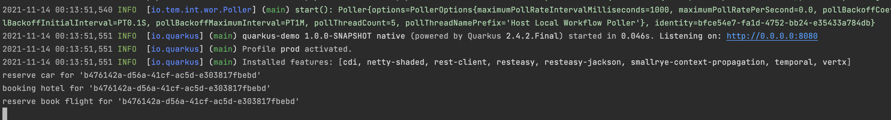

# Quarkus Temporal Demo

This project main goal is to test [quarkus-temporal-extension](https://github.com/mostafacs/quarkus-temporal-extension)

## Run Project
#### Requirement :
- JDK 11
- Temporal Server [install and run temporal](https://docs.temporal.io/docs/server/quick-install/)
```shell
./mvnw quarkus:dev
```

## Build
build your runner jar
```shell
./mvnw package
```

## Native Image Build
#### Requirements
- graalvm-ce-java11-21.2.0

```shell
./mvnw package -Pnative
```
